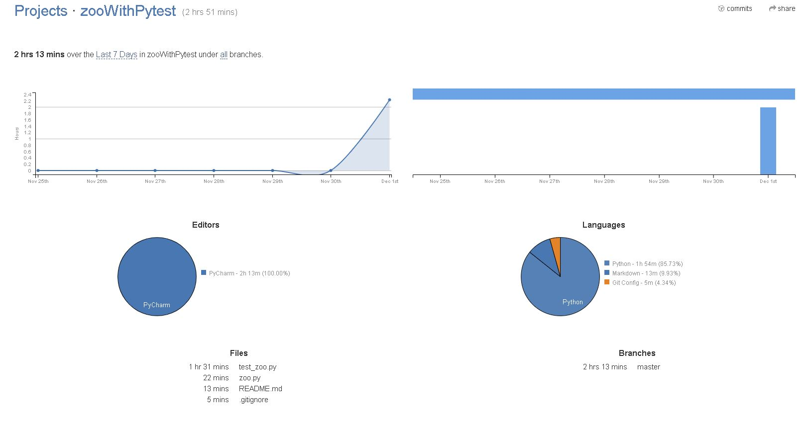
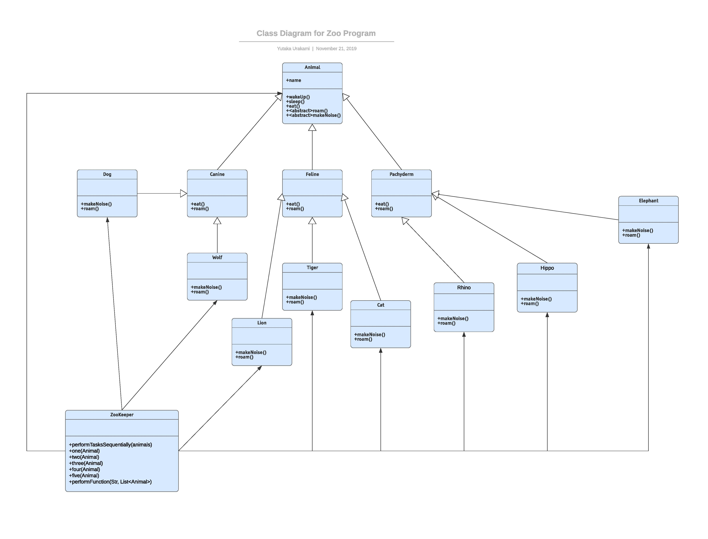

# ZooKeeper with Pytest

This repo is for the research project of Fall 2019 CSCI 5448: Object-Oriented Analysis and Design

Based on [this code](https://github.com/sanikadongre/OOAD_F19_Homeworks_Projects/blob/master/Project2/Q1a/zoo.py), made test cases using pytest.

### Project Member:
[Yutaka Urakami](https://github.com/Uyutaka)

[Sanika Dongre](https://github.com/sanikadongre)


### Time to implement


### UML


### The way to run tests
```
pytest
```